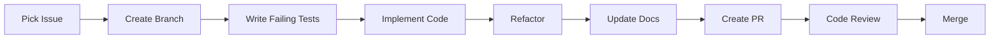

# MAOS Development Workflow

This document defines the systematic development process for the Multi-Agent Orchestration System (MAOS), emphasizing thorough planning, detailed issue tracking, and comprehensive code review.

## Table of Contents

1. [Core Principles](#core-principles)
2. [Planning Phase](#planning-phase)
3. [GitHub Project Setup](#github-project-setup)
4. [Issue Creation Standards](#issue-creation-standards)
5. [Development Process](#development-process)
6. [Code Review Process](#code-review-process)
7. [Documentation Requirements](#documentation-requirements)
8. [Quality Gates](#quality-gates)

## Core Principles

1. **Plan Before Code** - No implementation without comprehensive planning
2. **Issue-Driven Development** - Every change tracked through detailed GitHub issues
3. **Specification First** - Complete specs before implementation
4. **Multi-Agent Review** - Primary development by one agent, review by another
5. **Documentation as Code** - All plans versioned in markdown

## Planning Phase

### 1. Architecture Decision Records (ADRs)

Before any major implementation:

```markdown
docs/architecture/decisions/
├── 001-use-ddd-architecture.md
├── 002-sqlite-over-redis.md
├── 003-capnproto-for-ipc.md
└── 004-event-sourcing-pattern.md
```

**ADR Template:**
```markdown
# ADR-XXX: [Decision Title]

## Status
[Proposed | Accepted | Deprecated]

## Context
What is the issue we're addressing?

## Decision
What have we decided to do?

## Consequences
What are the positive and negative outcomes?

## Alternatives Considered
What other options did we evaluate?
```

### 2. Domain Model Documentation

```markdown
docs/domain-model/
├── aggregates/
│   ├── agent.md
│   ├── task.md
│   └── orchestration.md
├── value-objects/
│   ├── agent-id.md
│   └── capability.md
├── domain-events.md
└── ubiquitous-language.md
```

### 3. Technical Specifications

```markdown
docs/specifications/
├── api/
│   ├── cli-commands.md
│   └── mcp-protocol.md
├── persistence/
│   └── database-schema.md
└── messaging/
    └── ipc-protocol.md
```

## GitHub Project Setup

### 1. Project Board Structure

**Columns:**
1. **📋 Backlog** - All planned work
2. **🎯 Ready** - Fully specified, ready for development
3. **🚧 In Progress** - Currently being implemented
4. **👀 In Review** - PR submitted, awaiting review
5. **✅ Done** - Merged to main

### 2. Labels System

**Type Labels:**
- `type:feature` - New functionality
- `type:bug` - Defect fix
- `type:refactor` - Code improvement
- `type:docs` - Documentation
- `type:test` - Test additions
- `type:chore` - Maintenance

**Component Labels:**
- `component:domain` - Domain layer
- `component:application` - Application layer
- `component:infrastructure` - Infrastructure layer
- `component:cli` - Presentation layer

**Priority Labels:**
- `priority:critical` - Must have
- `priority:high` - Should have
- `priority:medium` - Could have
- `priority:low` - Nice to have

**Status Labels:**
- `status:needs-spec` - Requires specification
- `status:ready` - Ready for development
- `status:blocked` - Waiting on dependency

### 3. Milestones

```
v0.1.0 - Domain Foundation
├── Agent Aggregate
├── Task Aggregate
├── Basic Event System
└── Domain Tests

v0.2.0 - Application Layer
├── Use Cases
├── Command/Query Handlers
└── Application Tests

v0.3.0 - Infrastructure
├── SQLite Persistence
├── IPC Messaging
├── Agent Adapters
└── Infrastructure Tests
```

## Issue Creation Standards

### Issue Template

```markdown
---
name: Development Task
about: Standard template for development tasks
title: '[Component] Brief description'
labels: 'type:feature, component:domain, priority:high'
assignees: ''
---

## Overview
Brief description of what needs to be implemented.

## Acceptance Criteria
- [ ] Specific, measurable outcome 1
- [ ] Specific, measurable outcome 2
- [ ] All tests pass with >90% coverage
- [ ] Documentation updated

## Technical Specification

### Domain Model (if applicable)
```rust
// Example aggregate structure
pub struct Agent {
    id: AgentId,
    name: String,
    capabilities: Vec<Capability>,
    status: AgentStatus,
}
```

### API Design (if applicable)
```rust
// Public API
impl Agent {
    pub fn register(id: AgentId, name: String, capabilities: Vec<Capability>) -> Self;
    pub fn assign_task(&mut self, task: &Task) -> Result<(), DomainError>;
}
```

### Test Scenarios
1. **Happy Path**
   - Test: Agent can be registered with valid data
   - Expected: Agent created with Ready status

2. **Error Cases**
   - Test: Cannot register agent with empty name
   - Expected: Returns validation error

3. **Edge Cases**
   - Test: Agent with no capabilities
   - Expected: Valid but cannot accept tasks

## Implementation Notes
- Follow DDD principles
- Use TDD Red/Green/Refactor cycle
- Consider event sourcing for state changes

## Dependencies
- Blocked by: #[issue number]
- Blocks: #[issue number]

## Definition of Done
- [ ] Implementation complete
- [ ] Unit tests written and passing
- [ ] Integration tests (if applicable)
- [ ] Documentation updated
- [ ] Code reviewed by another agent
- [ ] PR merged to main
```

### Epic Template

```markdown
---
name: Epic
about: Large feature spanning multiple issues
title: 'EPIC: [Feature Name]'
labels: 'epic'
---

## Epic Overview
High-level description of the feature.

## Business Value
Why are we building this?

## Technical Approach
How will we implement it?

## Child Issues
- [ ] #1 - Setup domain model
- [ ] #2 - Implement use cases
- [ ] #3 - Add persistence
- [ ] #4 - Create CLI commands
- [ ] #5 - Integration tests

## Acceptance Criteria
- [ ] All child issues complete
- [ ] End-to-end tests pass
- [ ] Performance benchmarks met
- [ ] Documentation complete
```

## Development Process

### 1. Pre-Development Checklist

Before starting any issue:
- [ ] Issue has complete specification
- [ ] Acceptance criteria are clear
- [ ] Dependencies resolved
- [ ] Technical approach reviewed

### 2. Development Flow



### 3. Branch Naming

Format: `<type>/issue-<number>/<brief-description>`

Examples:
- `feature/issue-1/agent-aggregate`
- `fix/issue-23/task-assignment`
- `docs/issue-45/api-specification`

### 4. Commit Standards

#### Conventional Commit Format
Use semantic commit messages with GitHub issue linking:

**Format:** `<type>: <description> (#<issue_number>)`

**Types:**
- `feat:` - New features (minor version: 0.1.0 → 0.2.0)
- `fix:` - Bug fixes (patch version: 0.1.0 → 0.1.1)
- `chore:` - Maintenance tasks (no version bump)
- `docs:` - Documentation updates (no version bump)
- `refactor:` - Code refactoring (no version bump)
- `test:` - Adding/updating tests (no version bump)
- `ci:` - CI/CD pipeline changes (no version bump)
- `perf:` - Performance improvements (patch version)
- `style:` - Code formatting/style changes (no version bump)
- `build:` - Build system changes (no version bump)

**Breaking Changes:** Add `BREAKING CHANGE:` in commit body for major version bumps (0.1.0 → 1.0.0)

> **Note:** Only use automatic closing keywords (e.g., `Closes #57`) in the *final* commit or pull-request description when the issue is *fully resolved*. For intermediate work, reference the issue without closing it, e.g., `Relates to #57`, `Refs #57`, or simply `(#57)`.

**Examples:**
- `feat: implement agent registration system (#15)`
- `fix: resolve task assignment race condition (#23)`
- `chore: update dependencies to latest versions (#8)`
- `docs: add API documentation for orchestration (#42)`

#### Commit Requirements
Every commit must:
1. **Reference the issue**: Include issue number in commit message
2. **Pass all tests**: Run pre-commit checks before committing
3. **Include relevant documentation updates**: Keep docs in sync with code changes
4. **Be atomic**: Each commit should represent a single logical change
5. **Have clear description**: Explain what and why, not just what changed

### 5. Branch Protection Rules

**Repository Protection Settings:**
- **No direct pushes** - All changes via pull requests
- **Required status checks (blocking):**
  - `Test Suite (ubuntu-latest, stable)`
  - `Test Suite (macos-latest, stable)`
  - `Linting`
  - `Security Audit`
  
  All other checks must pass but are non-blocking.
- **Required reviews** - At least 1 approving review
- **Dismiss stale reviews** - Re-approval required after new commits
- **Require conversation resolution** - All review comments must be resolved

### 6. Release Process (Automated)

**Automated Release Pipeline:**
1. **Commit with conventional messages** during development
2. **Push to any branch** → `release-plz` creates/updates Release PR automatically
3. **Merge Release PR into `main`** → tag created, release job runs
4. **GitHub Actions** builds cross-platform binaries automatically
5. **Binaries published** to GitHub Releases with checksums

**Release Artifacts:**
- Cross-platform binaries (Linux, macOS, Windows)
- SHA256 checksums for verification
- Automated changelog generation
- Docker images (future consideration)

## Code Review Process

### 1. Pull Request Template

```markdown
## Summary
Brief description of changes.

## Related Issue
Closes #[issue number]

## Type of Change
- [ ] Bug fix
- [ ] New feature
- [ ] Refactoring
- [ ] Documentation

## Testing
- [ ] Unit tests pass
- [ ] Integration tests pass
- [ ] Coverage >90%

## Checklist
- [ ] Code follows DDD principles
- [ ] Tests follow TDD approach
- [ ] Documentation updated
- [ ] No direct domain dependencies
- [ ] Logging added appropriately

## Screenshots (if applicable)
[Add any relevant screenshots]
```

### 2. Review Criteria

**Automated Checks:**
- All CI/CD checks pass
- Test coverage maintained
- No linting errors
- Security scan clean

**Manual Review Points:**
- DDD principles followed
- Clean architecture maintained
- Tests comprehensive
- Code idiomatic
- Documentation clear

### 3. Review Assignment

- Primary developer: Implements the issue
- Code reviewer: Different agent (e.g., o3 high reasoning)
- Final approval: Repository owner

## Documentation Requirements

### 1. Code Documentation

```rust
/// Registers a new agent in the system.
/// 
/// # Arguments
/// * `id` - Unique identifier for the agent
/// * `name` - Human-readable name
/// * `capabilities` - List of agent capabilities
/// 
/// # Returns
/// * `Self` - The newly created agent
/// 
/// # Example
/// ```
/// let agent = Agent::register(
///     AgentId::new(),
///     "claude-1".to_string(),
///     vec![Capability::CodeGeneration]
/// );
/// assert_eq!(agent.status(), AgentStatus::Ready);
/// ```
pub fn register(id: AgentId, name: String, capabilities: Vec<Capability>) -> Self {
    // Implementation
}
```

### 2. Architecture Documentation

Each component must have:
- README.md explaining purpose
- Architecture diagram
- API documentation
- Example usage

### 3. Decision Documentation

Major decisions recorded in:
- ADRs for architecture choices
- Comments for non-obvious code
- Issues for implementation decisions

## Quality Gates

### 1. Definition of Ready

Issue is ready for development when:
- [ ] Specification complete
- [ ] Acceptance criteria defined
- [ ] Technical approach documented
- [ ] Dependencies identified
- [ ] Estimated and prioritized

### 2. Definition of Done

Issue is complete when:
- [ ] All acceptance criteria met
- [ ] Tests written and passing (>90% coverage)
- [ ] Documentation updated
- [ ] Code reviewed and approved
- [ ] CI/CD checks pass
- [ ] Merged to main

### 3. Release Criteria

Version is ready for release when:
- [ ] All milestone issues complete
- [ ] Integration tests pass
- [ ] Performance benchmarks met
- [ ] Documentation complete
- [ ] CHANGELOG updated
- [ ] Release notes prepared

## Planning Documents

### Required Plans Before Coding

1. **Project Roadmap** (`docs/ROADMAP.md`)
   - Milestone definitions
   - Timeline estimates
   - Dependency mapping

2. **Technical Architecture** (`docs/ARCHITECTURE.md`)
   - System design
   - Component interactions
   - Technology choices

3. **API Specification** (`docs/API.md`)
   - Command structure
   - Input/output formats
   - Error handling

4. **Testing Strategy** (`docs/TESTING.md`)
   - Test types and coverage
   - Testing tools
   - Performance benchmarks

## Workflow Integration

This workflow integrates with [AGENT_INSTRUCTIONS.md](./AGENT_INSTRUCTIONS.md) by:

1. **Enforcing TDD** - Tests required before implementation
2. **Maintaining DDD** - Clear separation of concerns
3. **Following Git Flow** - Structured branching and merging
4. **Ensuring Quality** - Multiple review checkpoints

## Architecture & Design Principles

### Domain-Driven Design & Clean Architecture

#### Core Principles (Big Blue Book - Eric Evans)
- **Domain Model First** - Business logic drives the design
- **Ubiquitous Language** - Same terms used by domain experts and code
- **Bounded Context** - Clear boundaries between different domains
- **Entities** - Objects with identity and lifecycle (own their state)
- **Value Objects** - Immutable objects representing concepts
- **Domain Services** - Stateless operations that don't belong to entities

#### Clean Architecture Layers
```
┌─────────────────┐
│   Presentation  │ ← CLI, Web UI (main.rs, handlers)
├─────────────────┤
│   Application   │ ← Use cases, orchestration
├─────────────────┤
│     Domain      │ ← Business logic, entities, value objects
├─────────────────┤
│ Infrastructure  │ ← External services, databases, transport
└─────────────────┘
```

**Rules:**
- **Domain layer** has NO dependencies on outer layers
- **Entities** manage their own state and lifecycle  
- **No anemic domain models** - behavior belongs with data
- **Dependency inversion** - abstractions don't depend on details

#### TDD for Domain Modeling
1. **RED**: Write failing test describing domain behavior
2. **GREEN**: Implement minimal domain model to pass test
3. **REFACTOR**: Extract value objects, improve domain design
4. **Domain Test Structure**:
   ```rust
   #[cfg(test)]
   mod domain_tests {
       use super::*;
       
       #[tokio::test]
       async fn test_entity_lifecycle() { /* Test state transitions */ }
       
       #[tokio::test] 
       async fn test_business_invariants() { /* Test domain rules */ }
       
       #[tokio::test]
       async fn test_value_object_immutability() { /* Test value objects */ }
   }
   ```

### Architecture Overview

MAOS is a multi-agent orchestration system built with Domain-Driven Design principles, supporting various AI agents (Claude, GPT, Ollama, custom) with persistent task management and high-performance IPC.

#### Core Flow
```
Agent Registration → Task Creation → Capability Matching → Task Assignment → Execution → Result Collection
```

#### Key Components
- **Domain Layer** - Pure business logic (aggregates, value objects, domain services)
- **Application Layer** - Use cases and orchestration logic
- **Infrastructure Layer** - Persistence, messaging, agent adapters
- **Presentation Layer** - CLI interface

#### Project Structure
- `crates/maos-domain/` - Domain models and business logic
- `crates/maos-application/` - Use cases and application services
- `crates/maos-infrastructure/` - Technical implementations
- `crates/maos-cli/` - Command-line interface
- `crates/maos-tests/` - Integration and acceptance tests

## Coding Standards

### Test-First Development (TDD)
- **MUST** Write failing tests before implementation
- **MUST** Implement simplest solution to pass tests
- **MUST** Refactor to make code idiomatic
- **MUST** Cover: happy path, errors, edge cases
- **MUST** Mock external services
- **MUST** Keep tests in the same module as the code under test

### Rust Coding Standards

#### File Organization
```rust
// 1. Standard library
use std::collections::HashMap;

// 2. Crate-local
use crate::config::ApiConfig;

// 3. External crates (alphabetized)
use axum::{extract::State, http::StatusCode};
use serde::{Deserialize, Serialize};
```

#### Naming Conventions
- `snake_case` - functions, variables
- `CamelCase` - types, structs, enums
- `SCREAMING_SNAKE_CASE` - constants

#### Logging Standards
- **ALWAYS use the `tracing` crate** for all logging
- **NEVER use `println!`, `eprintln!`, or `dbg!`** in production code
- **Log levels:**
  - `error!` - Errors that need immediate attention
  - `warn!` - Important warnings that don't stop execution
  - `info!` - High-level operational information
  - `debug!` - Detailed information for debugging
  - `trace!` - Very detailed trace information
- **Include context** in log messages with structured fields:
  ```rust
  use tracing::{debug, error, info, warn};
  
  // Good - structured logging with context
  info!(template_path = %path.display(), "Loading template");
  error!(error = %e, file = ?file_path, "Failed to read template");
  
  // Bad - no context, uses println
  println!("Loading template");
  eprintln!("Error: {}", e);
  ```

#### Method Organization
**Public methods:** 
- Place immediately after struct/impl declaration
- Order alphabetically 
- Full documentation with examples, arguments, returns, errors

**Private methods:**
- Place at bottom of impl block
- Order alphabetically
- Simple summary comments only (single line preferred)

**Example structure:**
```rust
impl MyStruct {
    // Public methods (alphabetical)
    pub fn create() -> Self { ... }
    pub fn process(&self) -> Result<()> { ... }
    pub fn validate(&self) -> bool { ... }
    
    // Private methods (alphabetical)  
    fn extract_data(&self) -> Vec<Data> { ... }
    fn parse_input(&self, input: &str) -> Result<Value> { ... }
    fn sanitize_output(&self, data: &Data) -> String { ... }
}
```

## Development Commands

### Quick Commands Reference
```bash
# Pre-commit check
cargo fmt --all -- --check && cargo clippy --all-targets --all-features -- -D warnings && cargo test

# Builds
cargo build             # Debug build
cargo build --release   # Release build

# Tests
cargo test --all-features --lib     # Unit tests
cargo test --all-features --doc     # Doc tests
cargo test --test integration   # Integration tests

# Run MAOS
cargo run -- agent register     # Register a new agent
cargo run -- task create        # Create a new task
cargo run -- orchestrate        # Start orchestration
```

## Getting Started

1. Review this workflow document
2. Check the GitHub project board
3. Pick an issue marked `status:ready`
4. Follow the development process
5. Submit PR for review

Remember: **Plan twice, code once!**

---

*This workflow ensures systematic, high-quality development of MAOS with minimal refactoring needs.*