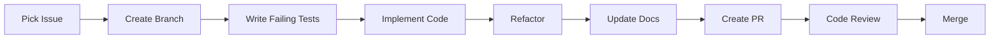

# MAOS Development Workflow

This document defines the systematic development process for the Multi-Agent Orchestration System (MAOS), emphasizing thorough planning, detailed issue tracking, and comprehensive code review.

## Table of Contents

1. [Core Principles](#core-principles)
2. [Planning Phase](#planning-phase)
3. [GitHub Project Setup](#github-project-setup)
4. [Issue Creation Standards](#issue-creation-standards)
5. [Development Process](#development-process)
6. [Code Review Process](#code-review-process)
7. [Documentation Requirements](#documentation-requirements)
8. [Quality Gates](#quality-gates)

## Core Principles

1. **Plan Before Code** - No implementation without comprehensive planning
2. **Issue-Driven Development** - Every change tracked through detailed GitHub issues
3. **Specification First** - Complete specs before implementation
4. **Multi-Agent Review** - Primary development by one agent, review by another
5. **Documentation as Code** - All plans versioned in markdown

## Planning Phase

### 1. Architecture Decision Records (ADRs)

Before any major implementation:

```markdown
docs/architecture/decisions/
├── 001-use-hook-based-orchestration.md
├── 002-json-over-sqlite.md
├── 003-git-worktree-isolation.md
└── 004-session-based-coordination.md
```

**ADR Template:**
```markdown
# ADR-XXX: [Decision Title]

## Status
[Proposed | Accepted | Deprecated]

## Context
What is the issue we're addressing?

## Decision
What have we decided to do?

## Consequences
What are the positive and negative outcomes?

## Alternatives Considered
What other options did we evaluate?
```

### 2. Hook System Documentation

```markdown
docs/hooks/
├── lifecycle/
│   ├── pre_tool_use.md
│   ├── post_tool_use.md
│   └── session_management.md
├── patterns/
│   ├── tool-interception.md
│   ├── agent-isolation.md
│   └── error-handling.md
└── security/
    └── dangerous-operations.md
```

### 3. Technical Specifications

```markdown
docs/specifications/
├── hooks/
│   ├── hook-api.md
│   └── tool-handlers.md
├── coordination/
│   └── session-files.md
└── agents/
    └── agent-definitions.md
```

## GitHub Project Setup

### 1. Project Board Structure

**Columns:**
1. **📋 Backlog** - All planned work
2. **🎯 Ready** - Fully specified, ready for development
3. **🚧 In Progress** - Currently being implemented
4. **👀 In Review** - PR submitted, awaiting review
5. **✅ Done** - Merged to main

### 2. Labels System

**Type Labels:**
- `type:feature` - New functionality
- `type:bug` - Defect fix
- `type:refactor` - Code improvement
- `type:docs` - Documentation
- `type:test` - Test additions
- `type:chore` - Maintenance

**Component Labels:**
- `component:hooks` - Hook system
- `component:agents` - Agent definitions
- `component:orchestration` - Orchestration logic
- `component:testing` - Test infrastructure

**Priority Labels:**
- `priority:critical` - Must have
- `priority:high` - Should have
- `priority:medium` - Could have
- `priority:low` - Nice to have

**Status Labels:**
- `status:needs-spec` - Requires specification
- `status:ready` - Ready for development
- `status:blocked` - Waiting on dependency

### 3. Milestones

```
v0.1.0 - Hook Foundation
├── Basic hook system
├── Tool interception
├── Session management
└── Integration tests

v0.2.0 - Agent Orchestration
├── Worktree isolation
├── Multi-agent coordination
└── Lock management

v0.3.0 - Production Ready
├── Performance optimization
├── Comprehensive testing
├── Documentation
└── Error recovery
```

## Issue Creation Standards

### Issue Template

```markdown
---
name: Development Task
about: Standard template for development tasks
title: '[Component] Brief description'
labels: 'type:feature, component:hooks, priority:high'
assignees: ''
---

## Overview
Brief description of what needs to be implemented.

## Acceptance Criteria
- [ ] Specific, measurable outcome 1
- [ ] Specific, measurable outcome 2
- [ ] All tests pass
- [ ] Documentation updated

## Technical Specification

### Hook Implementation (if applicable)
```python
def pre_tool_use(tool_name, tool_args):
    """Intercept tool before execution"""
    # Implementation details
```

### Coordination Files (if applicable)
```json
{
  "session_id": "sess-123",
  "agents": [],
  "locks": {}
}
```

### Test Scenarios
1. **Happy Path**
   - Test: Hook intercepts tool correctly
   - Expected: Tool modified as intended

2. **Error Cases**
   - Test: Invalid tool arguments
   - Expected: Graceful error handling

3. **Edge Cases**
   - Test: Concurrent hook execution
   - Expected: Thread-safe operation

## Implementation Notes
- Follow Python best practices
- Use TDD approach
- Consider concurrency implications

## Dependencies
- Blocked by: #[issue number]
- Blocks: #[issue number]

## Definition of Done
- [ ] Implementation complete
- [ ] Unit tests written and passing
- [ ] Integration tests (if applicable)
- [ ] Documentation updated
- [ ] Code reviewed by another agent
- [ ] PR merged to main
```

### Epic Template

```markdown
---
name: Epic
about: Large feature spanning multiple issues
title: 'EPIC: [Feature Name]'
labels: 'epic'
---

## Epic Overview
High-level description of the feature.

## Business Value
Why are we building this?

## Technical Approach
How will we implement it?

## Child Issues
- [ ] #1 - Setup hook infrastructure
- [ ] #2 - Implement tool handlers
- [ ] #3 - Add session management
- [ ] #4 - Create integration tests
- [ ] #5 - Write documentation

## Acceptance Criteria
- [ ] All child issues complete
- [ ] End-to-end tests pass
- [ ] Performance benchmarks met
- [ ] Documentation complete
```

## Development Process

### 1. Pre-Development Checklist

Before starting any issue:
- [ ] Issue has complete specification
- [ ] Acceptance criteria are clear
- [ ] Dependencies resolved
- [ ] Technical approach reviewed

### 2. Development Flow



### 3. Branch Naming

Format: `<type>/issue-<number>/<brief-description>`

Examples:
- `feature/issue-1/hook-interception`
- `fix/issue-23/worktree-cleanup`
- `docs/issue-45/api-specification`

### 4. Commit Standards

#### Conventional Commit Format
Use semantic commit messages with GitHub issue linking:

**Format:** `<type>: <description> (#<issue_number>)`

**Types:**
- `feat:` - New features
- `fix:` - Bug fixes
- `chore:` - Maintenance tasks
- `docs:` - Documentation updates
- `refactor:` - Code refactoring
- `test:` - Adding/updating tests
- `perf:` - Performance improvements
- `style:` - Code formatting/style changes

**Breaking Changes:** Add `BREAKING CHANGE:` in commit body for major changes

> **Note:** Only use automatic closing keywords (e.g., `Closes #57`) in the *final* commit or pull-request description when the issue is *fully resolved*. For intermediate work, reference the issue without closing it, e.g., `Relates to #57`, `Refs #57`, or simply `(#57)`.

**Examples:**
- `feat: implement pre_tool_use hook (#15)`
- `fix: resolve worktree creation race condition (#23)`
- `chore: update dependencies (#8)`
- `docs: add hook documentation (#42)`

### 5. Branch Protection Rules

**Repository Protection Settings:**
- **No direct pushes** - All changes via pull requests
- **Required status checks:**
  - `Python Tests`
  - `Integration Tests`
  - `Linting (flake8/black)`
  
- **Required reviews** - At least 1 approving review
- **Dismiss stale reviews** - Re-approval required after new commits
- **Require conversation resolution** - All review comments must be resolved

## Code Review Process

### 1. Pull Request Template

```markdown
## Summary
Brief description of changes.

## Related Issue
Closes #[issue number]

## Type of Change
- [ ] Bug fix
- [ ] New feature
- [ ] Refactoring
- [ ] Documentation

## Testing
- [ ] Unit tests pass
- [ ] Integration tests pass
- [ ] Manual testing completed

## Checklist
- [ ] Code follows Python conventions
- [ ] Tests follow TDD approach
- [ ] Documentation updated
- [ ] No hardcoded paths
- [ ] Logging added appropriately

## Screenshots (if applicable)
[Add any relevant screenshots]
```

### 2. Review Criteria

**Automated Checks:**
- All CI/CD checks pass
- Test coverage maintained
- No linting errors

**Manual Review Points:**
- Clean code principles followed
- Error handling comprehensive
- Tests meaningful
- Documentation clear

### 3. Review Assignment

- Primary developer: Implements the issue
- Code reviewer: Different agent
- Final approval: Repository owner

## Documentation Requirements

### 1. Code Documentation

```python
def register_agent(session_id: str, agent_name: str, worktree_path: str) -> dict:
    """
    Register a new agent in the session.
    
    Args:
        session_id: Unique session identifier
        agent_name: Name of the agent to register
        worktree_path: Path to agent's git worktree
        
    Returns:
        dict: Agent registration details
        
    Raises:
        ValueError: If agent already registered
        
    Example:
        >>> register_agent("sess-123", "backend-engineer", "/tmp/worktrees/backend")
        {'agent_id': 'backend-engineer', 'status': 'active'}
    """
    # Implementation
```

### 2. Architecture Documentation

Each component must have:
- README.md explaining purpose
- Architecture diagram (if complex)
- Usage examples
- Configuration options

### 3. Decision Documentation

Major decisions recorded in:
- ADRs for architecture choices
- Comments for non-obvious code
- Issues for implementation decisions

## Quality Gates

### 1. Definition of Ready

Issue is ready for development when:
- [ ] Specification complete
- [ ] Acceptance criteria defined
- [ ] Technical approach documented
- [ ] Dependencies identified
- [ ] Estimated and prioritized

### 2. Definition of Done

Issue is complete when:
- [ ] All acceptance criteria met
- [ ] Tests written and passing
- [ ] Documentation updated
- [ ] Code reviewed and approved
- [ ] CI/CD checks pass
- [ ] Merged to main

### 3. Release Criteria

Version is ready for release when:
- [ ] All milestone issues complete
- [ ] Integration tests pass
- [ ] Performance benchmarks met
- [ ] Documentation complete
- [ ] CHANGELOG updated
- [ ] Release notes prepared

## Python Development Standards

### File Organization
```python
# 1. Standard library
import json
import os
from pathlib import Path

# 2. Third-party imports (if any)
import pytest

# 3. Local imports
from .utils import get_project_root
from .handlers import ToolHandler
```

### Testing Standards

#### Test Structure
```python
class TestHookSystem:
    """Test hook system functionality"""
    
    def test_tool_interception(self):
        """Test that tools are intercepted correctly"""
        # Given
        tool_name = "Task"
        tool_args = {"subagent_type": "backend-engineer"}
        
        # When
        result = pre_tool_use(tool_name, tool_args)
        
        # Then
        assert result["intercepted"] is True
        assert "worktree" in result
    
    def test_error_handling(self):
        """Test graceful error handling"""
        # Test implementation
```

### Logging Standards
```python
import logging

logger = logging.getLogger(__name__)

# Good - structured logging with context
logger.info("Loading hook configuration", extra={"hook": "pre_tool_use"})
logger.error("Failed to create worktree", exc_info=True, extra={"agent": agent_name})

# Bad - no context
print("Loading configuration")
```

## Development Commands

### Quick Commands Reference
```bash
# Run tests
python -m pytest tests/
python -m pytest tests/test_hooks.py -v

# Linting
black .
flake8 .

# Integration tests
./test_integration.py

# Manual testing
python .claude/hooks/pre_tool_use.py
```

## Getting Started

1. Review this workflow document
2. Check the GitHub project board
3. Pick an issue marked `status:ready`
4. Follow the development process
5. Submit PR for review

Remember: **Plan twice, code once!**

---

*This workflow ensures systematic, high-quality development of MAOS with minimal refactoring needs.*