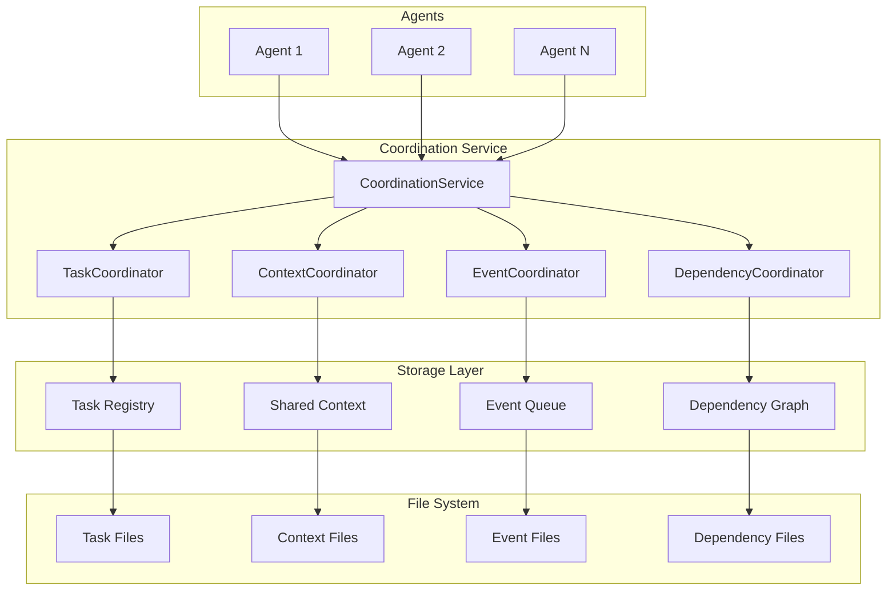

# Coordination Service Design

## Overview

The Coordination Service provides file-based communication and coordination patterns for MAOS agents. It enables agents to share context, synchronize work, and coordinate activities without complex messaging infrastructure.

## Architecture



## Core Components

### 1. Coordination Service

```rust
use std::path::{Path, PathBuf};
use tokio::sync::RwLock;
use notify::{Watcher, RecursiveMode};

pub struct CoordinationService {
    root_path: PathBuf,
    task_coordinator: TaskCoordinator,
    context_coordinator: ContextCoordinator,
    event_coordinator: EventCoordinator,
    dependency_coordinator: DependencyCoordinator,
    file_watcher: Arc<RwLock<FileWatcher>>,
}

impl CoordinationService {
    pub fn new(root_path: impl AsRef<Path>) -> Result<Self> {
        let root_path = root_path.as_ref().to_path_buf();
        let coord_path = root_path.join(".maos/coordination");
        
        // Create coordination directory structure
        Self::initialize_directories(&coord_path)?;
        
        Ok(Self {
            root_path: root_path.clone(),
            task_coordinator: TaskCoordinator::new(&coord_path)?,
            context_coordinator: ContextCoordinator::new(&coord_path)?,
            event_coordinator: EventCoordinator::new(&coord_path)?,
            dependency_coordinator: DependencyCoordinator::new(&coord_path)?,
            file_watcher: Arc::new(RwLock::new(FileWatcher::new(&coord_path)?)),
        })
    }
    
    fn initialize_directories(coord_path: &Path) -> Result<()> {
        let dirs = [
            "tasks",
            "context",
            "events",
            "dependencies",
            "locks",
            "status",
        ];
        
        for dir in &dirs {
            std::fs::create_dir_all(coord_path.join(dir))?;
        }
        
        Ok(())
    }
    
    // High-level coordination operations
    
    pub async fn register_agent(
        &self,
        agent_id: &str,
        agent_role: &str,
        capabilities: Vec<String>,
    ) -> Result<AgentRegistration> {
        // Register with all coordinators
        let task_reg = self.task_coordinator.register_agent(agent_id).await?;
        let context_reg = self.context_coordinator.register_agent(agent_id).await?;
        let event_reg = self.event_coordinator.subscribe_agent(agent_id).await?;
        
        // Create agent registration
        let registration = AgentRegistration {
            agent_id: agent_id.to_string(),
            agent_role: agent_role.to_string(),
            capabilities,
            registered_at: Utc::now(),
            status: AgentCoordStatus::Active,
        };
        
        // Write registration file
        let reg_path = self.get_agent_registration_path(agent_id);
        let reg_json = serde_json::to_string_pretty(&registration)?;
        tokio::fs::write(&reg_path, reg_json).await?;
        
        Ok(registration)
    }
    
    pub async fn coordinate_task(
        &self,
        task: Task,
        dependencies: Vec<String>,
    ) -> Result<TaskHandle> {
        // Check dependencies
        let deps_ready = self.dependency_coordinator
            .check_dependencies(&dependencies)
            .await?;
        
        if !deps_ready {
            return Err(Error::DependenciesNotReady(dependencies));
        }
        
        // Register task
        let handle = self.task_coordinator.create_task(task).await?;
        
        // Set up dependency tracking
        self.dependency_coordinator
            .register_task_dependencies(&handle.task_id, dependencies)
            .await?;
        
        // Emit task created event
        self.event_coordinator.emit_event(Event::TaskCreated {
            task_id: handle.task_id.clone(),
            agent_id: task.assigned_to.clone(),
        }).await?;
        
        Ok(handle)
    }
}
```

### 2. Task Coordinator

```rust
use serde::{Deserialize, Serialize};
use std::collections::HashMap;

#[derive(Debug, Clone, Serialize, Deserialize)]
pub struct Task {
    pub id: String,
    pub name: String,
    pub description: String,
    pub assigned_to: String,
    pub priority: TaskPriority,
    pub status: TaskStatus,
    pub created_at: DateTime<Utc>,
    pub updated_at: DateTime<Utc>,
    pub outputs: Vec<String>,
    pub metadata: HashMap<String, serde_json::Value>,
}

#[derive(Debug, Clone, Serialize, Deserialize)]
pub enum TaskStatus {
    Pending,
    InProgress,
    Blocked(String),
    Completed,
    Failed(String),
}

pub struct TaskCoordinator {
    tasks_path: PathBuf,
    registry: Arc<RwLock<TaskRegistry>>,
}

impl TaskCoordinator {
    pub async fn create_task(&self, mut task: Task) -> Result<TaskHandle> {
        // Generate task ID if not provided
        if task.id.is_empty() {
            task.id = format!("task-{}", Uuid::new_v4());
        }
        
        // Set timestamps
        task.created_at = Utc::now();
        task.updated_at = task.created_at;
        
        // Write task file
        let task_file = self.tasks_path.join(format!("{}.json", task.id));
        let task_json = serde_json::to_string_pretty(&task)?;
        tokio::fs::write(&task_file, task_json).await?;
        
        // Update registry
        let mut registry = self.registry.write().await;
        registry.add_task(task.clone())?;
        
        // Create task handle
        Ok(TaskHandle {
            task_id: task.id.clone(),
            coordinator: self.clone(),
        })
    }
    
    pub async fn update_task_status(
        &self,
        task_id: &str,
        status: TaskStatus,
    ) -> Result<()> {
        // Read current task
        let task_file = self.tasks_path.join(format!("{}.json", task_id));
        let task_data = tokio::fs::read_to_string(&task_file).await?;
        let mut task: Task = serde_json::from_str(&task_data)?;
        
        // Update status
        task.status = status;
        task.updated_at = Utc::now();
        
        // Write updated task
        let task_json = serde_json::to_string_pretty(&task)?;
        tokio::fs::write(&task_file, task_json).await?;
        
        // Update registry
        let mut registry = self.registry.write().await;
        registry.update_task(task)?;
        
        Ok(())
    }
    
    pub async fn get_tasks_for_agent(
        &self,
        agent_id: &str,
    ) -> Result<Vec<Task>> {
        let registry = self.registry.read().await;
        Ok(registry.get_tasks_by_agent(agent_id))
    }
    
    pub async fn claim_next_task(
        &self,
        agent_id: &str,
        capabilities: &[String],
    ) -> Result<Option<Task>> {
        let mut registry = self.registry.write().await;
        
        // Find unclaimed task matching capabilities
        let available_tasks = registry.get_available_tasks();
        
        for task in available_tasks {
            if self.agent_can_handle_task(capabilities, &task) {
                // Claim the task
                registry.claim_task(&task.id, agent_id)?;
                
                // Update task file
                let mut claimed_task = task.clone();
                claimed_task.assigned_to = agent_id.to_string();
                claimed_task.status = TaskStatus::InProgress;
                claimed_task.updated_at = Utc::now();
                
                let task_file = self.tasks_path.join(format!("{}.json", claimed_task.id));
                let task_json = serde_json::to_string_pretty(&claimed_task)?;
                tokio::fs::write(&task_file, task_json).await?;
                
                return Ok(Some(claimed_task));
            }
        }
        
        Ok(None)
    }
}

pub struct TaskHandle {
    task_id: String,
    coordinator: TaskCoordinator,
}

impl TaskHandle {
    pub async fn update_status(&self, status: TaskStatus) -> Result<()> {
        self.coordinator.update_task_status(&self.task_id, status).await
    }
    
    pub async fn add_output(&self, output_path: String) -> Result<()> {
        // Implementation for adding task outputs
        Ok(())
    }
}
```

### 3. Context Coordinator

```rust
#[derive(Debug, Clone, Serialize, Deserialize)]
pub struct SharedContext {
    pub key: String,
    pub value: serde_json::Value,
    pub owner: String,
    pub visibility: ContextVisibility,
    pub created_at: DateTime<Utc>,
    pub updated_at: DateTime<Utc>,
    pub expires_at: Option<DateTime<Utc>>,
    pub metadata: HashMap<String, String>,
}

#[derive(Debug, Clone, Serialize, Deserialize)]
pub enum ContextVisibility {
    Private,       // Only owner can read
    Shared,        // All agents can read
    Restricted(Vec<String>), // Specific agents can read
}

pub struct ContextCoordinator {
    context_path: PathBuf,
    index: Arc<RwLock<ContextIndex>>,
}

impl ContextCoordinator {
    pub async fn set_context(
        &self,
        key: &str,
        value: serde_json::Value,
        owner: &str,
        visibility: ContextVisibility,
    ) -> Result<()> {
        let context = SharedContext {
            key: key.to_string(),
            value,
            owner: owner.to_string(),
            visibility,
            created_at: Utc::now(),
            updated_at: Utc::now(),
            expires_at: None,
            metadata: HashMap::new(),
        };
        
        // Write context file
        let context_file = self.context_path.join(format!("{}.json", key));
        let context_json = serde_json::to_string_pretty(&context)?;
        tokio::fs::write(&context_file, context_json).await?;
        
        // Update index
        let mut index = self.index.write().await;
        index.add_context(key.to_string(), context.clone())?;
        
        Ok(())
    }
    
    pub async fn get_context(
        &self,
        key: &str,
        reader: &str,
    ) -> Result<Option<serde_json::Value>> {
        let index = self.index.read().await;
        
        if let Some(context) = index.get_context(key) {
            // Check visibility
            if self.can_read_context(context, reader) {
                return Ok(Some(context.value.clone()));
            }
        }
        
        Ok(None)
    }
    
    pub async fn watch_context(
        &self,
        key: &str,
        watcher_id: &str,
    ) -> Result<ContextWatcher> {
        // Set up file watcher for specific context
        let context_file = self.context_path.join(format!("{}.json", key));
        
        let (tx, rx) = tokio::sync::mpsc::channel(100);
        let watcher = ContextWatcher {
            key: key.to_string(),
            watcher_id: watcher_id.to_string(),
            receiver: rx,
        };
        
        // Start watching file
        let mut file_watcher = self.index.write().await;
        file_watcher.add_watcher(key, tx)?;
        
        Ok(watcher)
    }
    
    fn can_read_context(&self, context: &SharedContext, reader: &str) -> bool {
        match &context.visibility {
            ContextVisibility::Private => context.owner == reader,
            ContextVisibility::Shared => true,
            ContextVisibility::Restricted(agents) => {
                agents.contains(&reader.to_string()) || context.owner == reader
            }
        }
    }
}

pub struct ContextWatcher {
    key: String,
    watcher_id: String,
    receiver: tokio::sync::mpsc::Receiver<ContextUpdate>,
}

impl ContextWatcher {
    pub async fn wait_for_update(&mut self) -> Option<ContextUpdate> {
        self.receiver.recv().await
    }
}
```

### 4. Event Coordinator

```rust
#[derive(Debug, Clone, Serialize, Deserialize)]
pub enum Event {
    TaskCreated { task_id: String, agent_id: String },
    TaskCompleted { task_id: String, outputs: Vec<String> },
    TaskFailed { task_id: String, error: String },
    ContextUpdated { key: String, updated_by: String },
    AgentStarted { agent_id: String, role: String },
    AgentStopped { agent_id: String, reason: String },
    DependencyReady { dependency_id: String },
    Custom { event_type: String, data: serde_json::Value },
}

pub struct EventCoordinator {
    events_path: PathBuf,
    subscriptions: Arc<RwLock<HashMap<String, Vec<EventFilter>>>>,
    event_queue: Arc<RwLock<EventQueue>>,
}

impl EventCoordinator {
    pub async fn emit_event(&self, event: Event) -> Result<()> {
        let event_id = Uuid::new_v4().to_string();
        let event_wrapper = EventWrapper {
            id: event_id.clone(),
            event,
            timestamp: Utc::now(),
        };
        
        // Write event to file
        let event_file = self.events_path.join(format!("{}.json", event_id));
        let event_json = serde_json::to_string_pretty(&event_wrapper)?;
        tokio::fs::write(&event_file, event_json).await?;
        
        // Add to queue
        let mut queue = self.event_queue.write().await;
        queue.push(event_wrapper.clone())?;
        
        // Notify subscribers
        self.notify_subscribers(&event_wrapper).await?;
        
        Ok(())
    }
    
    pub async fn subscribe(
        &self,
        agent_id: &str,
        filter: EventFilter,
    ) -> Result<EventSubscription> {
        let mut subs = self.subscriptions.write().await;
        
        subs.entry(agent_id.to_string())
            .or_insert_with(Vec::new)
            .push(filter.clone());
        
        // Create subscription handle
        let (tx, rx) = tokio::sync::mpsc::channel(100);
        
        Ok(EventSubscription {
            agent_id: agent_id.to_string(),
            filter,
            receiver: rx,
        })
    }
    
    async fn notify_subscribers(&self, event: &EventWrapper) -> Result<()> {
        let subs = self.subscriptions.read().await;
        
        for (agent_id, filters) in subs.iter() {
            for filter in filters {
                if filter.matches(&event.event) {
                    // Send to subscriber
                    // Implementation depends on notification mechanism
                }
            }
        }
        
        Ok(())
    }
}

#[derive(Debug, Clone)]
pub struct EventFilter {
    pub event_types: Option<Vec<String>>,
    pub agents: Option<Vec<String>>,
    pub metadata_filters: HashMap<String, String>,
}

impl EventFilter {
    pub fn matches(&self, event: &Event) -> bool {
        // Implementation of event matching logic
        true
    }
}
```

### 5. Dependency Coordinator

```rust
use petgraph::graph::{DiGraph, NodeIndex};
use petgraph::algo::has_path_connecting;

#[derive(Debug, Clone, Serialize, Deserialize)]
pub struct Dependency {
    pub id: String,
    pub provider: String,
    pub consumer: String,
    pub artifact_type: ArtifactType,
    pub artifact_path: Option<String>,
    pub status: DependencyStatus,
}

#[derive(Debug, Clone, Serialize, Deserialize)]
pub enum DependencyStatus {
    Pending,
    InProgress,
    Ready,
    Failed(String),
}

pub struct DependencyCoordinator {
    deps_path: PathBuf,
    graph: Arc<RwLock<DependencyGraph>>,
}

struct DependencyGraph {
    graph: DiGraph<String, Dependency>,
    node_map: HashMap<String, NodeIndex>,
}

impl DependencyCoordinator {
    pub async fn register_dependency(
        &self,
        provider: &str,
        consumer: &str,
        artifact_type: ArtifactType,
    ) -> Result<String> {
        let dep = Dependency {
            id: Uuid::new_v4().to_string(),
            provider: provider.to_string(),
            consumer: consumer.to_string(),
            artifact_type,
            artifact_path: None,
            status: DependencyStatus::Pending,
        };
        
        // Add to graph
        let mut graph = self.graph.write().await;
        graph.add_dependency(&dep)?;
        
        // Check for cycles
        if graph.has_cycle() {
            graph.remove_dependency(&dep.id)?;
            return Err(Error::CyclicDependency);
        }
        
        // Write dependency file
        let dep_file = self.deps_path.join(format!("{}.json", dep.id));
        let dep_json = serde_json::to_string_pretty(&dep)?;
        tokio::fs::write(&dep_file, dep_json).await?;
        
        Ok(dep.id)
    }
    
    pub async fn mark_dependency_ready(
        &self,
        dep_id: &str,
        artifact_path: String,
    ) -> Result<()> {
        // Update dependency file
        let dep_file = self.deps_path.join(format!("{}.json", dep_id));
        let dep_data = tokio::fs::read_to_string(&dep_file).await?;
        let mut dep: Dependency = serde_json::from_str(&dep_data)?;
        
        dep.status = DependencyStatus::Ready;
        dep.artifact_path = Some(artifact_path);
        
        let dep_json = serde_json::to_string_pretty(&dep)?;
        tokio::fs::write(&dep_file, dep_json).await?;
        
        // Update graph
        let mut graph = self.graph.write().await;
        graph.update_dependency_status(dep_id, DependencyStatus::Ready)?;
        
        // Emit event
        // ... emit dependency ready event
        
        Ok(())
    }
    
    pub async fn get_ready_tasks(&self, agent_id: &str) -> Result<Vec<String>> {
        let graph = self.graph.read().await;
        
        // Find tasks where all dependencies are ready
        let ready_tasks = graph.get_tasks_with_ready_dependencies(agent_id)?;
        
        Ok(ready_tasks)
    }
    
    pub async fn get_dependency_chain(&self, task_id: &str) -> Result<Vec<Dependency>> {
        let graph = self.graph.read().await;
        
        // Get all dependencies for a task
        let chain = graph.get_dependency_chain(task_id)?;
        
        Ok(chain)
    }
}

impl DependencyGraph {
    fn has_cycle(&self) -> bool {
        // Use petgraph's cycle detection
        petgraph::algo::is_cyclic_directed(&self.graph)
    }
    
    fn get_tasks_with_ready_dependencies(&self, agent_id: &str) -> Result<Vec<String>> {
        let mut ready_tasks = Vec::new();
        
        // Find nodes assigned to agent
        for (task_id, &node_idx) in &self.node_map {
            // Check if all incoming edges have ready dependencies
            let mut all_ready = true;
            
            for edge in self.graph.edges_directed(node_idx, petgraph::Direction::Incoming) {
                if let DependencyStatus::Ready = edge.weight().status {
                    continue;
                } else {
                    all_ready = false;
                    break;
                }
            }
            
            if all_ready {
                ready_tasks.push(task_id.clone());
            }
        }
        
        Ok(ready_tasks)
    }
}
```

## Coordination Patterns

### 1. Producer-Consumer Pattern

```rust
// Producer agent
let coordinator = CoordinationService::new("/project/root")?;

// Produce data
coordinator.context_coordinator.set_context(
    "api-spec",
    json!({
        "version": "1.0.0",
        "endpoints": [...],
        "schemas": [...]
    }),
    "api-architect",
    ContextVisibility::Shared,
).await?;

// Emit completion event
coordinator.event_coordinator.emit_event(
    Event::TaskCompleted {
        task_id: "design-api",
        outputs: vec!["api-spec"],
    }
).await?;

// Consumer agent
let api_spec = coordinator.context_coordinator.get_context(
    "api-spec",
    "backend-engineer"
).await?;
```

### 2. Synchronization Barrier

```rust
// Wait for multiple agents to complete
let barrier = coordinator.create_barrier(vec![
    "frontend-build",
    "backend-build",
    "database-migration"
]).await?;

// Each agent signals completion
coordinator.signal_barrier("frontend-build").await?;

// Wait for all to complete
barrier.wait().await?;
```

### 3. Task Pipeline

```rust
// Define pipeline stages
let pipeline = coordinator.create_pipeline(vec![
    PipelineStage {
        name: "design",
        agents: vec!["architect"],
        tasks: vec!["create-architecture"],
    },
    PipelineStage {
        name: "implement",
        agents: vec!["backend-engineer", "frontend-engineer"],
        tasks: vec!["implement-api", "implement-ui"],
    },
    PipelineStage {
        name: "test",
        agents: vec!["qa-engineer"],
        tasks: vec!["integration-tests"],
    },
]).await?;

// Execute pipeline
pipeline.execute().await?;
```

## Performance Optimizations

### 1. File System Optimizations
- Use atomic file operations
- Implement file locking for concurrent access
- Cache frequently accessed files in memory

### 2. Event Processing
- Batch event writes
- Use memory-mapped files for event queue
- Implement event compaction

### 3. Index Management
- Maintain in-memory indexes
- Periodic index persistence
- Lazy loading of large data

## Security Considerations

### 1. Access Control
- Validate agent permissions for all operations
- Implement file-based ACLs
- Audit all coordination operations

### 2. Data Integrity
- Use checksums for critical files
- Implement versioning for shared context
- Atomic write operations

### 3. Resource Protection
- Limit file sizes
- Implement rate limiting
- Monitor resource usage

## Monitoring and Debugging

### 1. Coordination Metrics
- Task completion rates
- Dependency resolution times
- Event processing latency
- Context access patterns

### 2. Debug Tools
- Coordination state viewer
- Event stream monitor
- Dependency graph visualizer
- Task timeline viewer

### 3. Health Checks
- File system availability
- Index consistency
- Event queue health
- Lock cleanup