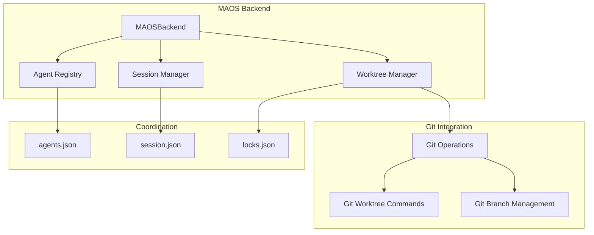

# Worktree Management Component Design

## Overview

The Worktree Management component provides efficient git worktree creation, lifecycle management, and cleanup for MAOS agents. It enables parallel development by giving each agent its own isolated workspace while sharing the same git repository.

## Architecture



## Core Components

### 1. MAOSBackend Class

The main orchestration class that manages worktrees for agents:

```python
import json
import subprocess
import time
import logging
from pathlib import Path
from datetime import datetime
from typing import Dict, Optional, Any

class MAOSBackend:
    """Backend utilities for MAOS orchestration - not user-facing"""
    
    def __init__(self):
        self.project_root = self.get_project_root()
        self.maos_dir = self.project_root / '.maos'
        self.sessions_dir = self.maos_dir / "sessions"
        self.worktrees_dir = self.project_root / 'worktrees'
        
        # Ensure directories exist
        self.maos_dir.mkdir(exist_ok=True)
        self.sessions_dir.mkdir(exist_ok=True)
        self.worktrees_dir.mkdir(exist_ok=True)
    
    def get_project_root(self):
        """Get project root using git or current working directory."""
        try:
            root = subprocess.check_output(
                ['git', 'rev-parse', '--show-toplevel'],
                stderr=subprocess.DEVNULL,
                text=True
            ).strip()
            return Path(root)
        except:
            return Path.cwd()
```

### 2. Worktree Creation

The core functionality for creating isolated workspaces:

```python
def prepare_workspace(self, agent_type: str, session_id: str) -> str:
    """Create git worktree for agent"""
    workspace = self.worktrees_dir / f"{agent_type}-{session_id}"
    branch = f"agent/session-{session_id}/{agent_type}"
    
    try:
        # Create worktree with new branch
        result = self.run_git_command([
            "worktree", "add", "-b", branch, str(workspace)
        ])
        if result.returncode != 0:
            raise subprocess.CalledProcessError(
                result.returncode, result.args, 
                result.stdout, result.stderr
            )
        
        # Track in session coordination
        self.register_agent(agent_type, session_id, str(workspace))
        
        return str(workspace)
        
    except subprocess.CalledProcessError:
        # Handle branch already exists
        return self._handle_existing_branch(
            agent_type, session_id, workspace, branch
        )

def _handle_existing_branch(self, agent_type, session_id, workspace, branch):
    """Handle case where branch already exists
    
    This method provides robust error handling for git worktree creation failures.
    It attempts multiple strategies to create a worktree when the branch exists.
    """
    try:
        # Strategy 1: Try to add worktree to existing branch
        result = self.run_git_command([
            "worktree", "add", str(workspace), branch
        ])
        if result.returncode == 0:
            self.register_agent(agent_type, session_id, str(workspace))
            return str(workspace)
        else:
            # Log specific error for debugging
            logging.error(f"Failed to add worktree to existing branch: {result.stderr}")
            
    except subprocess.CalledProcessError as e:
        logging.error(f"Error adding worktree to existing branch {branch}: {e}")
    
    # Strategy 2: Check if worktree already exists for this branch
    try:
        worktree_list = self.run_git_command(["worktree", "list", "--porcelain"])
        if worktree_list.returncode == 0:
            # Parse worktree list to check if branch is already checked out
            if worktree_list.stdout is not None:
                for line in worktree_list.stdout.split('\n'):
                    if line.startswith('branch ') and branch in line:
                        raise RuntimeError(
                            f"Branch '{branch}' is already checked out in another worktree. "
                            f"Please remove the existing worktree first."
                        )
    except subprocess.CalledProcessError as e:
        logging.warning(f"Could not check existing worktrees: {e}")
    
    # Strategy 3: Create unique branch name with timestamp
    timestamp = int(time.time())
    unique_workspace = self.worktrees_dir / f"{agent_type}-{session_id}-{timestamp}"
    unique_branch = f"agent/session-{session_id}/{agent_type}-{timestamp}"
    
    try:
        result = self.run_git_command([
            "worktree", "add", "-b", unique_branch, str(unique_workspace)
        ])
        if result.returncode != 0:
            stderr_msg = result.stderr if result.stderr else "No error output from git."
            raise RuntimeError(
                f"Failed to create worktree with unique branch '{unique_branch}': "
                f"{stderr_msg}\n"
                f"This might indicate a git configuration issue or disk space problem."
            )
        
        self.register_agent(agent_type, session_id, str(unique_workspace))
        return str(unique_workspace)
        
    except subprocess.CalledProcessError as e:
        raise RuntimeError(
            f"All worktree creation strategies failed for agent '{agent_type}' "
            f"in session '{session_id}'. Last error: {e}\n"
            f"Please check git configuration and disk space."
        )
```

### 3. Agent Registration

Track agents in the coordination system:

```python
def register_agent(self, agent_type: str, session_id: str, workspace: str):
    """Register agent in session coordination"""
    session_dir = self.sessions_dir / session_id
    agents_file = session_dir / "agents.json"
    
    # Load existing agents
    agents = []
    if agents_file.exists():
        with open(agents_file) as f:
            agents = json.load(f)
    
    # Add new agent
    agent_info = {
        "type": agent_type,
        "workspace": workspace,
        "created": datetime.now().isoformat(),
        "status": "active"
    }
    agents.append(agent_info)
    
    # Save updated list
    with open(agents_file, 'w') as f:
        json.dump(agents, f, indent=2)
```

### 4. Worktree Cleanup

Clean up worktrees when agents complete:

```python
def cleanup_worktree(self, workspace: str):
    """Remove a worktree and its branch"""
    try:
        # Remove the worktree
        result = self.run_git_command([
            "worktree", "remove", workspace, "--force"
        ])
        
        # Get branch name from worktree
        branch = self._get_worktree_branch(workspace)
        if branch:
            # Delete the branch
            self.run_git_command([
                "branch", "-D", branch
            ])
        
        return result.returncode == 0
    except subprocess.CalledProcessError:
        return False

def cleanup_session_worktrees(self, session_id: str):
    """Clean up all worktrees for a session"""
    session_dir = self.sessions_dir / session_id
    agents_file = session_dir / "agents.json"
    
    if not agents_file.exists():
        return
    
    with open(agents_file) as f:
        agents = json.load(f)
    
    for agent in agents:
        if agent.get('workspace'):
            self.cleanup_worktree(agent['workspace'])
```

### 5. Git Operations Helper

Centralized git command execution:

```python
def run_git_command(self, cmd, cwd=None):
    """Run git command with explicit directory specification."""
    if cwd is None:
        cwd = self.project_root
    
    # Always run git with explicit directory
    full_cmd = ['git', '-C', str(cwd)] + cmd
    
    return subprocess.run(
        full_cmd, 
        capture_output=True, 
        text=True
    )
```

## Coordination Files

### Agent Registry Format

`.maos/sessions/{session_id}/agents.json`:

```json
[
  {
    "type": "backend-engineer",
    "workspace": "/path/to/worktrees/backend-engineer-sess-123",
    "branch": "agent/session-sess-123/backend-engineer",
    "created": "2024-01-30T10:00:00Z",
    "status": "active"
  },
  {
    "type": "frontend-engineer",
    "workspace": "/path/to/worktrees/frontend-engineer-sess-123",
    "branch": "agent/session-sess-123/frontend-engineer",
    "created": "2024-01-30T10:01:00Z",
    "status": "active"
  }
]
```

### Lock File Format

`.maos/sessions/{session_id}/locks.json`:

```json
{
  "src/api/auth.py": {
    "agent": "backend-engineer",
    "locked_at": "2024-01-30T10:00:00Z",
    "workspace": "/path/to/worktrees/backend-engineer-sess-123"
  }
}
```

## Error Handling

```python
class WorktreeError(Exception):
    """Base exception for worktree operations"""
    pass

class WorktreeCreationError(WorktreeError):
    """Failed to create worktree"""
    pass

class WorktreeCleanupError(WorktreeError):
    """Failed to clean up worktree"""
    pass

def safe_prepare_workspace(self, agent_type: str, session_id: str) -> Optional[str]:
    """Safely prepare workspace with error handling"""
    try:
        return self.prepare_workspace(agent_type, session_id)
    except subprocess.CalledProcessError as e:
        logging.error(f"Git error creating worktree: {e.stderr}")
        return None
    except Exception as e:
        logging.error(f"Unexpected error: {e}")
        return None
```

## Performance Considerations

1. **Worktree Creation**: ~1-2 seconds per worktree
2. **Branch Operations**: ~100-200ms 
3. **File I/O**: JSON operations are fast (<10ms)
4. **Cleanup**: ~500ms per worktree removal

## Best Practices

1. **Always use absolute paths** - Avoid issues when Claude changes directories
2. **Check for existing worktrees** - Prevent conflicts
3. **Clean up on completion** - Don't leave orphaned worktrees
4. **Use unique branch names** - Include session ID and timestamp if needed
5. **Handle git failures gracefully** - Git operations can fail for many reasons

## Integration with Hooks

The worktree manager is called from the pre_tool_use hook:

```python
# .claude/hooks/pre_tool_use.py
if tool_name == "Task" and tool_input.get('subagent_type'):
    backend = MAOSBackend()
    workspace = backend.prepare_workspace(
        agent_type=tool_input['subagent_type'],
        session_id=backend.get_or_create_session()
    )
    if workspace:
        # Modify prompt to include workspace
        tool_input['prompt'] += f"\n\nWork in: {workspace}/"
```

This design provides a robust, Python-based worktree management system that integrates seamlessly with Claude Code's hook system.