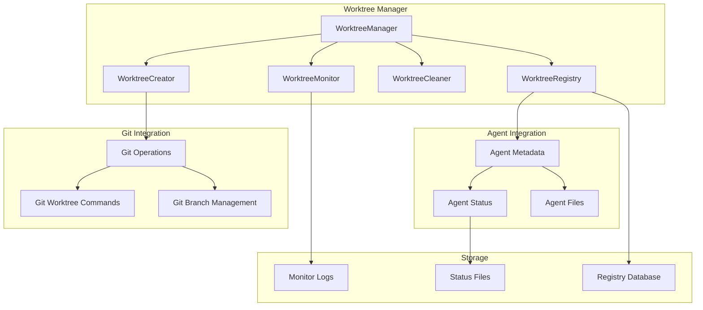

# Worktree Management Component Design

## Overview

The Worktree Management component provides efficient git worktree creation, lifecycle management, and cleanup for MAOS agents. It enables parallel development by giving each agent its own isolated workspace while sharing the same git repository.

## Architecture



## Core Components

### 1. WorktreeManager

```rust
use std::path::{Path, PathBuf};
use tokio::sync::RwLock;
use uuid::Uuid;

pub struct WorktreeManager {
    root_path: PathBuf,
    worktrees_dir: PathBuf,
    registry: Arc<RwLock<WorktreeRegistry>>,
    git_ops: GitOperations,
    monitor: WorktreeMonitor,
    cleaner: WorktreeCleaner,
}

impl WorktreeManager {
    pub fn new(root_path: impl AsRef<Path>) -> Result<Self> {
        let root_path = root_path.as_ref().to_path_buf();
        let worktrees_dir = root_path.join("worktrees");
        
        // Ensure worktrees directory exists
        std::fs::create_dir_all(&worktrees_dir)?;
        
        Ok(Self {
            root_path: root_path.clone(),
            worktrees_dir,
            registry: Arc::new(RwLock::new(WorktreeRegistry::load(&root_path)?)),
            git_ops: GitOperations::new(&root_path)?,
            monitor: WorktreeMonitor::new(),
            cleaner: WorktreeCleaner::new(),
        })
    }
    
    pub async fn create_agent_worktree(
        &self,
        agent_role: &str,
        issue_id: &str,
        task_description: &str,
        base_branch: Option<&str>,
    ) -> Result<WorktreeInfo> {
        // Generate unique worktree identifier
        let worktree_id = self.generate_worktree_id(agent_role, issue_id);
        
        // Create branch name following convention
        let branch_name = format!("{}/issue-{}/{}", 
            agent_role, 
            issue_id, 
            self.sanitize_task_desc(task_description)
        );
        
        // Determine worktree path
        let worktree_path = self.worktrees_dir.join(&worktree_id);
        
        // Check for conflicts
        self.check_conflicts(&branch_name, &worktree_path).await?;
        
        // Create the worktree
        let base = base_branch.unwrap_or("main");
        self.git_ops.create_worktree(
            &worktree_path,
            &branch_name,
            base,
        ).await?;
        
        // Lock the worktree
        let lock_reason = format!(
            "MAOS agent: {} working on issue {}",
            agent_role, issue_id
        );
        self.git_ops.lock_worktree(&worktree_path, &lock_reason).await?;
        
        // Create agent metadata
        let metadata = AgentMetadata {
            agent_id: Uuid::new_v4().to_string(),
            agent_role: agent_role.to_string(),
            issue_id: issue_id.to_string(),
            task_description: task_description.to_string(),
            branch_name: branch_name.clone(),
            worktree_path: worktree_path.clone(),
            created_at: chrono::Utc::now(),
            status: AgentStatus::Initializing,
            files_modified: Vec::new(),
        };
        
        // Write metadata to worktree
        let metadata_path = worktree_path.join(".agent-metadata.json");
        let metadata_json = serde_json::to_string_pretty(&metadata)?;
        tokio::fs::write(&metadata_path, metadata_json).await?;
        
        // Register in registry
        let mut registry = self.registry.write().await;
        registry.register_worktree(worktree_id.clone(), metadata.clone())?;
        
        // Start monitoring
        self.monitor.start_monitoring(&worktree_id).await?;
        
        Ok(WorktreeInfo {
            id: worktree_id,
            path: worktree_path,
            branch: branch_name,
            metadata,
        })
    }
    
    pub async fn remove_worktree(&self, worktree_id: &str) -> Result<()> {
        let mut registry = self.registry.write().await;
        
        // Get worktree info
        let info = registry.get_worktree(worktree_id)
            .ok_or(Error::WorktreeNotFound)?;
        
        // Stop monitoring
        self.monitor.stop_monitoring(worktree_id).await?;
        
        // Unlock worktree
        self.git_ops.unlock_worktree(&info.worktree_path).await?;
        
        // Remove worktree
        self.git_ops.remove_worktree(&info.worktree_path).await?;
        
        // Unregister from registry
        registry.unregister_worktree(worktree_id)?;
        
        Ok(())
    }
    
    pub async fn cleanup_completed(&self) -> Result<Vec<String>> {
        let registry = self.registry.read().await;
        let completed = registry.get_completed_worktrees();
        let mut removed = Vec::new();
        
        for worktree_id in completed {
            match self.remove_worktree(&worktree_id).await {
                Ok(_) => removed.push(worktree_id),
                Err(e) => log::warn!("Failed to remove worktree {}: {}", worktree_id, e),
            }
        }
        
        Ok(removed)
    }
}
```

### 2. Git Operations

```rust
use tokio::process::Command;
use std::process::Stdio;

pub struct GitOperations {
    repo_path: PathBuf,
}

impl GitOperations {
    pub async fn create_worktree(
        &self,
        worktree_path: &Path,
        branch_name: &str,
        base_branch: &str,
    ) -> Result<()> {
        // Check if branch already exists
        let branch_exists = self.branch_exists(branch_name).await?;
        
        let mut cmd = Command::new("git");
        cmd.current_dir(&self.repo_path)
            .arg("worktree")
            .arg("add");
        
        if !branch_exists {
            cmd.arg("-b");
        }
        
        cmd.arg(branch_name)
            .arg(worktree_path)
            .arg(base_branch);
        
        let output = cmd.output().await?;
        
        if !output.status.success() {
            return Err(Error::GitCommand(
                String::from_utf8_lossy(&output.stderr).to_string()
            ));
        }
        
        Ok(())
    }
    
    pub async fn lock_worktree(
        &self,
        worktree_path: &Path,
        reason: &str,
    ) -> Result<()> {
        let output = Command::new("git")
            .current_dir(&self.repo_path)
            .args(&["worktree", "lock", "--reason", reason])
            .arg(worktree_path)
            .output()
            .await?;
        
        if !output.status.success() {
            return Err(Error::GitCommand(
                String::from_utf8_lossy(&output.stderr).to_string()
            ));
        }
        
        Ok(())
    }
    
    pub async fn get_worktree_status(&self) -> Result<Vec<WorktreeStatus>> {
        let output = Command::new("git")
            .current_dir(&self.repo_path)
            .args(&["worktree", "list", "--porcelain"])
            .output()
            .await?;
        
        if !output.status.success() {
            return Err(Error::GitCommand(
                String::from_utf8_lossy(&output.stderr).to_string()
            ));
        }
        
        // Parse porcelain output
        let output_str = String::from_utf8(output.stdout)?;
        self.parse_worktree_list(&output_str)
    }
    
    async fn branch_exists(&self, branch_name: &str) -> Result<bool> {
        let output = Command::new("git")
            .current_dir(&self.repo_path)
            .args(&["show-ref", "--verify", "--quiet"])
            .arg(format!("refs/heads/{}", branch_name))
            .output()
            .await?;
        
        Ok(output.status.success())
    }
}
```

### 3. Worktree Registry

```rust
use serde::{Deserialize, Serialize};
use std::collections::HashMap;

#[derive(Debug, Clone, Serialize, Deserialize)]
pub struct WorktreeRegistry {
    worktrees: HashMap<String, WorktreeEntry>,
    #[serde(with = "chrono::serde::ts_seconds")]
    last_updated: DateTime<Utc>,
}

#[derive(Debug, Clone, Serialize, Deserialize)]
pub struct WorktreeEntry {
    pub metadata: AgentMetadata,
    pub health_status: HealthStatus,
    pub last_activity: DateTime<Utc>,
    pub resource_usage: ResourceUsage,
}

#[derive(Debug, Clone, Serialize, Deserialize)]
pub struct HealthStatus {
    pub is_healthy: bool,
    pub last_heartbeat: DateTime<Utc>,
    pub error_count: u32,
    pub warnings: Vec<String>,
}

impl WorktreeRegistry {
    pub fn load(root_path: &Path) -> Result<Self> {
        let registry_path = root_path.join(".maos/worktree-registry.json");
        
        if registry_path.exists() {
            let data = std::fs::read_to_string(&registry_path)?;
            Ok(serde_json::from_str(&data)?)
        } else {
            Ok(Self {
                worktrees: HashMap::new(),
                last_updated: Utc::now(),
            })
        }
    }
    
    pub fn save(&self, root_path: &Path) -> Result<()> {
        let registry_path = root_path.join(".maos/worktree-registry.json");
        let data = serde_json::to_string_pretty(self)?;
        
        // Atomic write
        let temp_path = registry_path.with_extension("tmp");
        std::fs::write(&temp_path, data)?;
        std::fs::rename(temp_path, registry_path)?;
        
        Ok(())
    }
    
    pub fn get_active_worktrees(&self) -> Vec<&WorktreeEntry> {
        self.worktrees.values()
            .filter(|entry| matches!(
                entry.metadata.status,
                AgentStatus::Active | AgentStatus::Initializing
            ))
            .collect()
    }
    
    pub fn check_file_conflicts(&self, files: &[String]) -> Vec<FileConflict> {
        let mut conflicts = Vec::new();
        
        for (worktree_id, entry) in &self.worktrees {
            if !matches!(entry.metadata.status, AgentStatus::Active) {
                continue;
            }
            
            for file in files {
                if entry.metadata.files_modified.contains(file) {
                    conflicts.push(FileConflict {
                        file: file.clone(),
                        worktree_id: worktree_id.clone(),
                        agent_role: entry.metadata.agent_role.clone(),
                    });
                }
            }
        }
        
        conflicts
    }
}
```

### 4. Worktree Monitor

```rust
use tokio::time::{interval, Duration};
use notify::{Watcher, RecursiveMode, Event};

pub struct WorktreeMonitor {
    monitors: Arc<RwLock<HashMap<String, MonitorHandle>>>,
}

struct MonitorHandle {
    watcher: Box<dyn Watcher>,
    cancel_token: CancellationToken,
    metrics: WorktreeMetrics,
}

#[derive(Default)]
struct WorktreeMetrics {
    files_changed: AtomicU64,
    last_activity: AtomicU64,
    cpu_usage: AtomicU64,
    memory_usage: AtomicU64,
}

impl WorktreeMonitor {
    pub async fn start_monitoring(&self, worktree_id: &str) -> Result<()> {
        let worktree_path = self.get_worktree_path(worktree_id)?;
        
        // Create file watcher
        let (tx, rx) = std::sync::mpsc::channel();
        let mut watcher = notify::recommended_watcher(tx)?;
        watcher.watch(&worktree_path, RecursiveMode::Recursive)?;
        
        // Create cancellation token
        let cancel_token = CancellationToken::new();
        let cancel_clone = cancel_token.clone();
        
        // Spawn monitoring task
        let worktree_id_clone = worktree_id.to_string();
        tokio::spawn(async move {
            let mut interval = interval(Duration::from_secs(5));
            
            loop {
                tokio::select! {
                    _ = cancel_clone.cancelled() => {
                        log::info!("Stopping monitor for {}", worktree_id_clone);
                        break;
                    }
                    _ = interval.tick() => {
                        // Collect metrics
                        if let Err(e) = self.collect_metrics(&worktree_id_clone).await {
                            log::warn!("Failed to collect metrics: {}", e);
                        }
                    }
                    Ok(event) = rx.recv() => {
                        // Handle file system events
                        self.handle_fs_event(&worktree_id_clone, event).await;
                    }
                }
            }
        });
        
        // Store monitor handle
        let mut monitors = self.monitors.write().await;
        monitors.insert(worktree_id.to_string(), MonitorHandle {
            watcher: Box::new(watcher),
            cancel_token,
            metrics: WorktreeMetrics::default(),
        });
        
        Ok(())
    }
    
    async fn collect_metrics(&self, worktree_id: &str) -> Result<()> {
        // Get process info for agents in this worktree
        let processes = self.find_agent_processes(worktree_id)?;
        
        let mut total_cpu = 0.0;
        let mut total_memory = 0;
        
        for process in processes {
            total_cpu += process.cpu_percent()?;
            total_memory += process.memory_info()?.rss();
        }
        
        // Update metrics
        if let Some(handle) = self.monitors.read().await.get(worktree_id) {
            handle.metrics.cpu_usage.store(
                (total_cpu * 100.0) as u64,
                Ordering::Relaxed
            );
            handle.metrics.memory_usage.store(
                total_memory,
                Ordering::Relaxed
            );
        }
        
        Ok(())
    }
}
```

### 5. Coordination Patterns

```rust
pub struct WorktreeCoordinator {
    registry: Arc<RwLock<WorktreeRegistry>>,
    conflict_resolver: ConflictResolver,
}

impl WorktreeCoordinator {
    pub async fn coordinate_file_access(
        &self,
        worktree_id: &str,
        files: Vec<String>,
        access_type: FileAccessType,
    ) -> Result<FileAccessDecision> {
        let registry = self.registry.read().await;
        
        // Check for conflicts
        let conflicts = registry.check_file_conflicts(&files);
        
        if conflicts.is_empty() {
            // No conflicts, grant access
            return Ok(FileAccessDecision::Granted);
        }
        
        // Attempt to resolve conflicts
        match access_type {
            FileAccessType::Read => {
                // Multiple readers are OK
                Ok(FileAccessDecision::Granted)
            }
            FileAccessType::Write => {
                // Check if we can coordinate
                let resolution = self.conflict_resolver
                    .resolve(&conflicts, worktree_id)
                    .await?;
                
                match resolution {
                    ConflictResolution::Proceed => Ok(FileAccessDecision::Granted),
                    ConflictResolution::Wait(duration) => {
                        Ok(FileAccessDecision::WaitAndRetry(duration))
                    }
                    ConflictResolution::Abort => {
                        Ok(FileAccessDecision::Denied(
                            "File is being modified by another agent".to_string()
                        ))
                    }
                }
            }
        }
    }
    
    pub async fn broadcast_status_update(
        &self,
        worktree_id: &str,
        status: AgentStatus,
    ) -> Result<()> {
        // Update registry
        let mut registry = self.registry.write().await;
        if let Some(entry) = registry.worktrees.get_mut(worktree_id) {
            entry.metadata.status = status;
            entry.last_activity = Utc::now();
        }
        
        // Write status file for other agents
        let status_dir = self.get_status_dir()?;
        let status_file = status_dir.join(format!("{}.status", worktree_id));
        
        let status_data = serde_json::json!({
            "worktree_id": worktree_id,
            "status": status,
            "timestamp": Utc::now(),
        });
        
        tokio::fs::write(
            &status_file,
            serde_json::to_string_pretty(&status_data)?
        ).await?;
        
        Ok(())
    }
}
```

## Usage Patterns

### Creating Agent Worktrees

```rust
// Example: Create worktree for backend engineer
let manager = WorktreeManager::new("/path/to/repo")?;

let worktree_info = manager.create_agent_worktree(
    "backend-engineer",
    "42",
    "implement-user-authentication",
    Some("develop"),
).await?;

println!("Created worktree at: {}", worktree_info.path.display());
println!("Branch: {}", worktree_info.branch);
```

### Monitoring Active Agents

```rust
// Get status of all active worktrees
let registry = manager.get_registry().await;
let active = registry.get_active_worktrees();

for entry in active {
    println!("Agent: {} - Status: {:?}", 
        entry.metadata.agent_role, 
        entry.metadata.status
    );
    println!("  Files modified: {:?}", entry.metadata.files_modified);
    println!("  CPU: {}%, Memory: {} MB", 
        entry.resource_usage.cpu_percent,
        entry.resource_usage.memory_mb
    );
}
```

### Cleanup Operations

```rust
// Automatic cleanup of completed worktrees
let removed = manager.cleanup_completed().await?;
println!("Removed {} completed worktrees", removed.len());

// Manual cleanup of old worktrees
let old_worktrees = manager.find_worktrees_older_than(
    Duration::from_days(7)
).await?;

for worktree_id in old_worktrees {
    manager.remove_worktree(&worktree_id).await?;
}
```

## Performance Optimizations

### 1. Lazy Loading
- Load worktree metadata only when needed
- Cache frequently accessed data in memory

### 2. Batch Operations
- Group git commands for efficiency
- Batch file system operations

### 3. Async Everything
- All I/O operations are async
- Parallel processing where possible

### 4. Resource Pooling
- Reuse git process handles
- Pool file watchers

## Security Considerations

### 1. Path Validation
- Ensure all worktrees are within designated directory
- Prevent path traversal attacks

### 2. Branch Protection
- Validate branch names
- Prevent conflicts with protected branches

### 3. Resource Limits
- Limit number of active worktrees
- Monitor disk space usage

### 4. Access Control
- Verify agent permissions before worktree creation
- Audit all worktree operations

## Integration Points

### 1. Agent Manager
- Notifies when worktree is ready
- Receives status updates from agents

### 2. Security System
- Validates worktree operations
- Monitors for suspicious activity

### 3. Coordination Service
- Provides conflict resolution
- Manages shared resources

### 4. Monitoring Dashboard
- Real-time worktree status
- Resource usage visualization