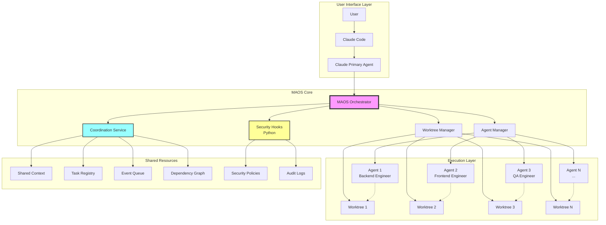
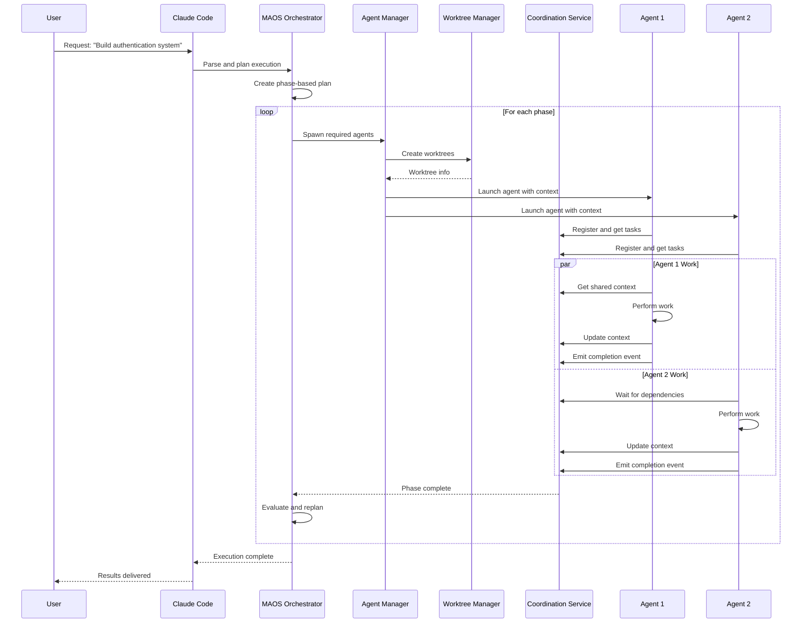
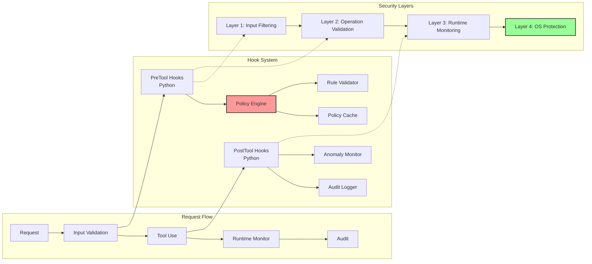
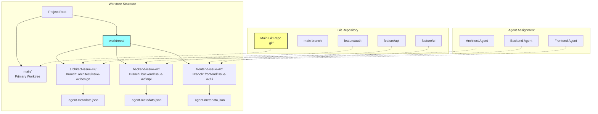
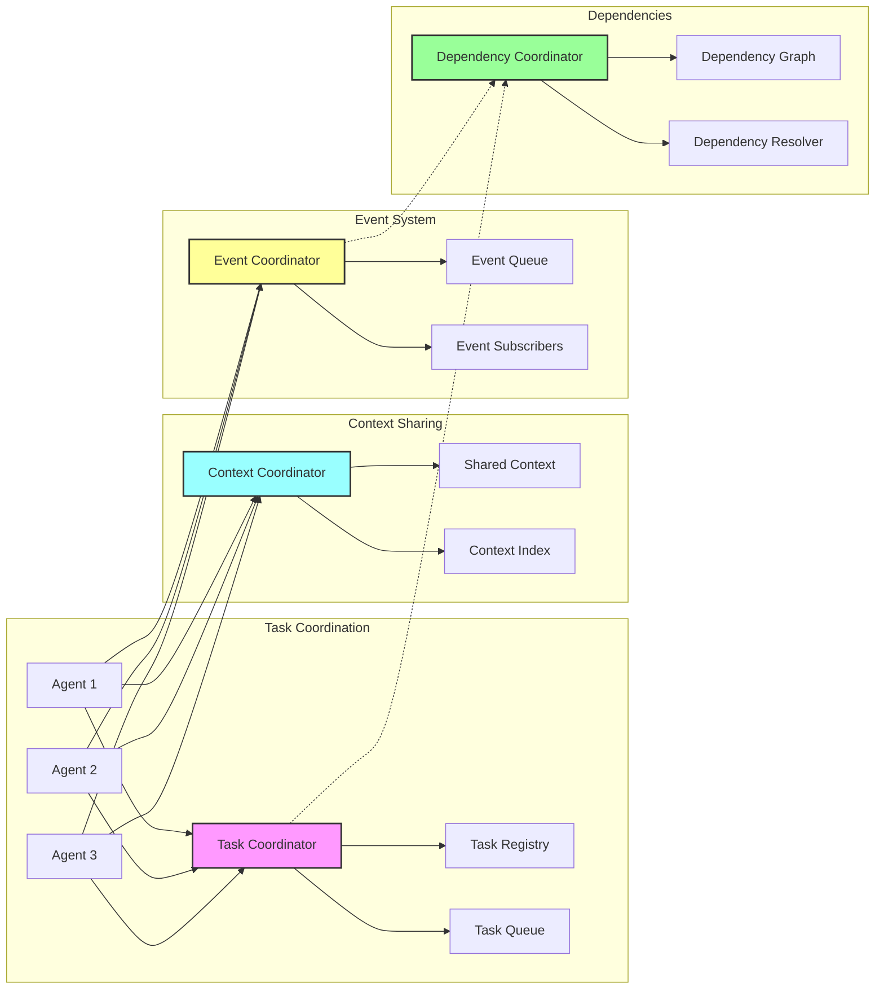
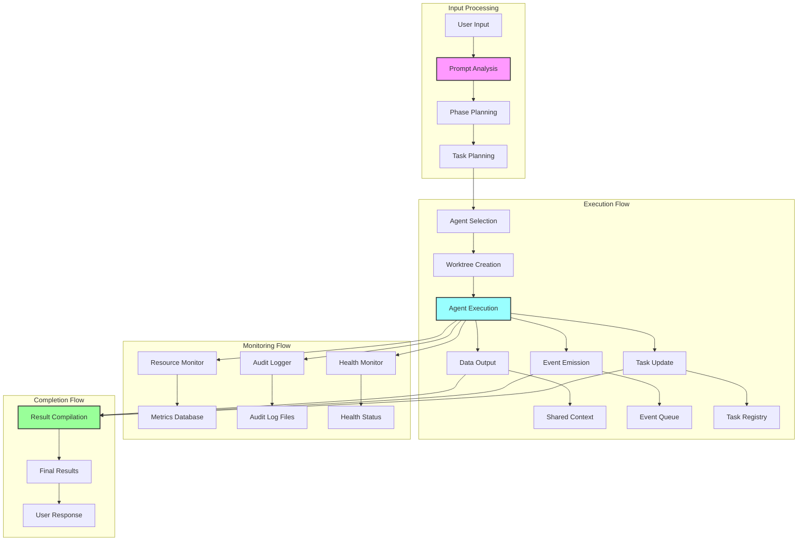
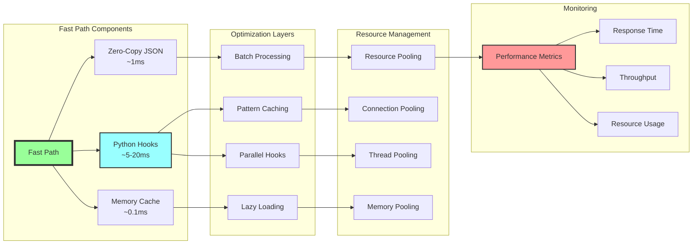
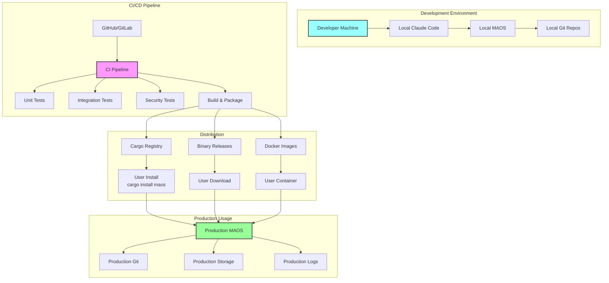
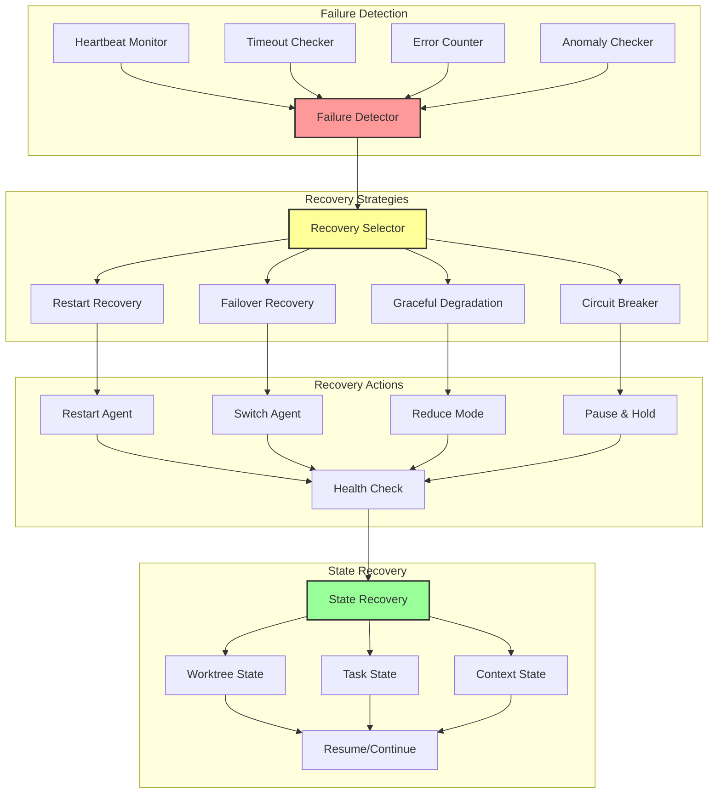

# MAOS Architecture Diagrams

## System Overview

## Component Interaction Flow

## Security Architecture

## Worktree Management

## Coordination Patterns

## Data Flow Architecture

## Performance Architecture

## Deployment Architecture

## Failure Recovery Architecture

## Summary

These architectural diagrams illustrate the key components and interactions within the MAOS system:

1. **System Overview**: Shows the layered architecture from user interface to shared resources
2. **Component Interaction**: Details the sequence of operations for multi-agent workflows
3. **Security Architecture**: Illustrates the multi-layered security approach
4. **Worktree Management**: Demonstrates git worktree organization and agent assignment
5. **Coordination Patterns**: Shows how agents coordinate through various services
6. **Data Flow**: Traces data movement through the system
7. **Performance Architecture**: Highlights optimization strategies
8. **Deployment Architecture**: Shows development to production pipeline
9. **Failure Recovery**: Illustrates resilience and recovery mechanisms

Each diagram focuses on a specific aspect while maintaining consistency with the overall architecture, providing a comprehensive view of the MAOS multi-agent orchestration system.